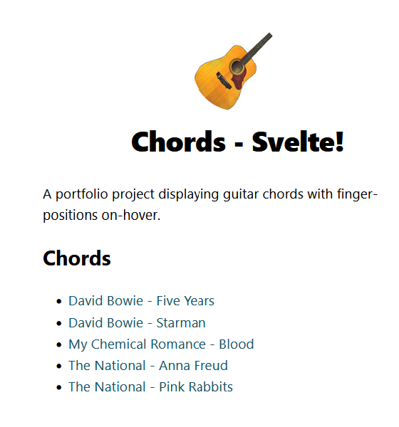

# Chords - Svelte

A portfolio project displaying guitar chords with finger-positions on-hover. Part of my Chords project - building the same site in different frameworks/with different tools.

This edition is built using [Svelte](https://svelte.dev/) and [SvelteKit](https://svelte.dev/) web framework.

Making use of:

- Markdown templates
- Svelte components and pages
- A scoped npm package to parse chord data from files [@emilkloeden/chordify](https://www.npmjs.com/package/@emilkloeden/chordify)
- Deployed to Netlify

## See it in action

Visit [Chords - Svelte](https://adorable-liger-1769be.netlify.app/) on Netlify.
